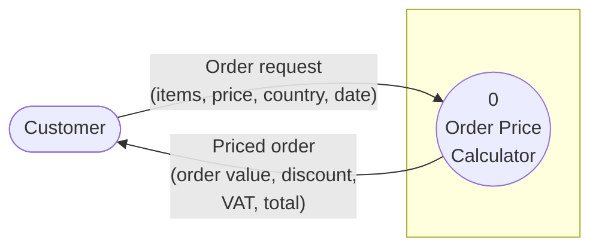
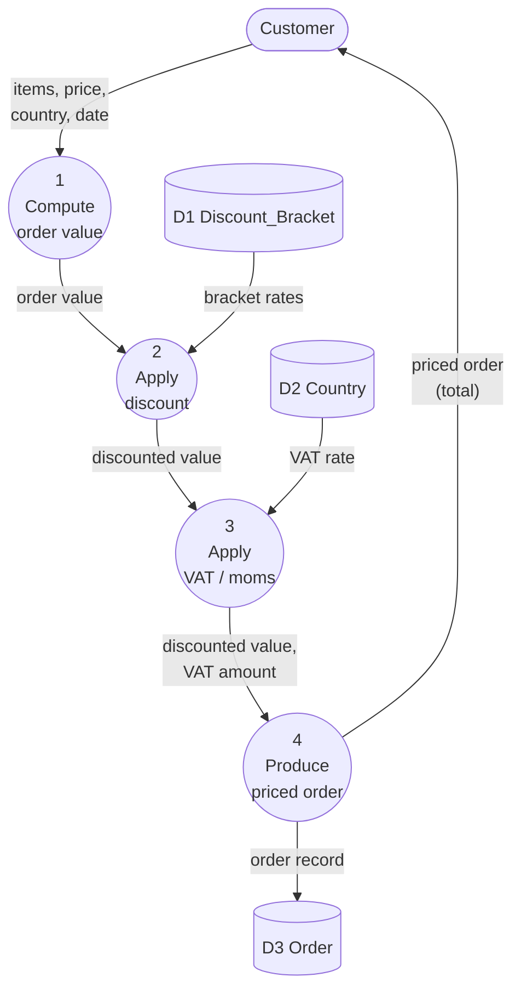
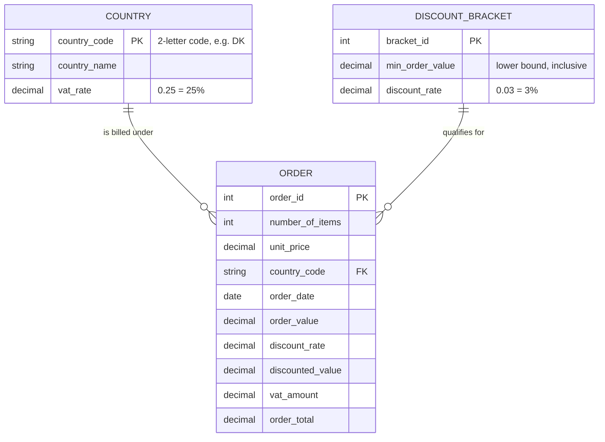

# Stage 1 — Order Price Calculator
## Traditional (Structured) Analysis Design

This document contains the three Stage‑1 analysis models required by the
traditional approach (see *Traditional Approach Requirements.pdf*):

1. **Context Diagram** – most abstract view, whole system as one process
2. **Data Flow Diagram (Level 1 / Diagram 0)** – the internal processes
3. **Entity‑Relationship Diagram (ERD)** – the things the system stores

Supporting documentation (data flow definitions, data element definitions and
structured‑English process descriptions) is included at the end, because the
DFD components must each be defined formally.

---

## 1. Problem statement (the event)

> **Event:** *Customer wants to know the total price of an order.*
>
> The customer supplies **number of items**, a **unit price**, a **2‑letter
> country code** (and a **date**, used later in Stage 2). The system computes
> the order value, applies a value‑based discount, adds the country VAT/moms on
> the discounted value, and returns the order total.

### Business rules

**Discount (based on order value, tiered):**

| Order value (≥) | Discount rate |
|-----------------|---------------|
| 0               | 0 %           |
| 1,000           | 3 %           |
| 5,000           | 5 %           |
| 7,000           | 7 %           |
| 10,000          | 10 %          |
| 50,000          | 15 %          |

**VAT / Moms (by country):**

| Country code | Country     | VAT rate |
|--------------|-------------|----------|
| DK           | Denmark     | 25 %     |
| BE           | Belgium     | 21 %     |
| DE           | Germany     | 19 %     |
| NL           | Netherlands | 21 %     |
| FR           | France      | 20 %     |

**Formula**

```
order_value      = number_of_items * unit_price
discount_rate    = lookup(order_value)          -- tiered bracket
discounted_value = order_value * (1 - discount_rate)
vat_rate         = lookup(country_code)          -- country table
vat_amount       = discounted_value * vat_rate
order_total      = discounted_value + vat_amount
```

---

## 2. Context Diagram

The entire system is a single process. One external agent (**Customer**)
supplies the order request and receives the priced order. Data stores are *not*
shown on a context diagram — they are internal to the system.



Plain‑text version (in case Mermaid does not render):

```
                 Order request
   +----------+  (items, price, country, date)   +------------------------+
   |          | -------------------------------> |          0             |
   | Customer |                                   |  Order Price Calculator|
   |          | <------------------------------- |        (system)        |
   +----------+   Priced order                    +------------------------+
                  (order value, discount,
                   VAT amount, order total)
```

**System boundary:** everything inside the single process 0 is the system;
the Customer is outside it.

---

## 3. Data Flow Diagram — Level 1 (Diagram 0)

Process 0 is decomposed into four sub‑processes. Two data stores hold the
reference tables (they correspond to entities on the ERD). A third store,
**D3 Order**, records the completed order — it is needed for Stage 2
(spreadsheet reporting) and makes the Order entity on the ERD "real".



Plain‑text version:

```
 Customer
   |  items, price, country, date
   v
 (1) Compute order value
   |  order value
   v
 (2) Apply discount  <----- [ D1 Discount_Bracket ]
   |  discounted value
   v
 (3) Apply VAT/moms  <----- [ D2 Country ]
   |  discounted value + VAT amount
   v
 (4) Produce priced order ----> [ D3 Order ]
   |  priced order (order value, discount, VAT, total)
   v
 Customer
```

**Notes**
- No *black holes* (every process has an output) and no *miracles* (every
  output is derived from an input or a data store) — the two consistency
  checks from the chapter.
- Each process has ≤ 7±2 data flows (Miller's rule).
- This is a **logical** DFD: it does not assume Python, a spreadsheet, a web
  page or any particular technology.

---

## 4. Entity‑Relationship Diagram (ERD)



Plain‑text version:

```
 +------------------+          +--------------------+          +-------------------+
 |     COUNTRY      | 1      * |       ORDER        | *      1 | DISCOUNT_BRACKET  |
 |------------------|----------|--------------------|----------|-------------------|
 | country_code PK  |          | order_id PK        |          | bracket_id PK     |
 | country_name     |          | number_of_items    |          | min_order_value   |
 | vat_rate         |          | unit_price         |          | discount_rate     |
 +------------------+          | country_code   FK  |          +-------------------+
                               | order_date         |
                               | order_value        |
                               | discount_rate      |
                               | discounted_value   |
                               | vat_amount         |
                               | order_total        |
                               +--------------------+
```

**Relationships**
- One **COUNTRY** can appear on many **ORDER**s (1‑to‑many).
- One **DISCOUNT_BRACKET** can apply to many **ORDER**s (1‑to‑many).
- On the DFD these two entities appear as the data stores **D2 Country** and
  **D1 Discount_Bracket**; the **ORDER** entity is data store **D3 Order**.

---

## 5. Data flow definitions (data dictionary)

```
order_request   = number_of_items + unit_price + country_code + order_date
priced_order    = order_value + discount_rate + discount_amount +
                  discounted_value + vat_rate + vat_amount + order_total
order_record    = order_id + number_of_items + unit_price + country_code +
                  order_date + order_value + discount_rate +
                  discounted_value + vat_amount + order_total
```

### Data element definitions

```
number_of_items   = a positive integer ( >= 1 )
unit_price        = a positive real number, 2 decimals (currency)
country_code      = a 2-letter code; one of { DK, BE, DE, NL, FR }
order_date        = a calendar date (YYYY-MM-DD); Stage 2 only
vat_rate          = a real number in [0,1]  ( 0.25 = 25% )
discount_rate     = a real number in [0,1]  ( 0.03 =  3% )
order_value       = number_of_items * unit_price
discounted_value  = order_value * (1 - discount_rate)
order_total       = discounted_value + vat_amount
```

---

## 6. Process descriptions (structured English)

```
Process 1 - Compute order value
    Accept number_of_items and unit_price
    order_value = number_of_items * unit_price
    Send order_value to Process 2

Process 2 - Apply discount
    Accept order_value
    Look up discount_rate for order_value in Discount_Bracket
        (highest min_order_value that is <= order_value)
    discount_amount  = order_value * discount_rate
    discounted_value = order_value - discount_amount
    Send discounted_value to Process 3

Process 3 - Apply VAT / moms
    Accept discounted_value and country_code
    Look up vat_rate for country_code in Country
    vat_amount = discounted_value * vat_rate
    Send discounted_value and vat_amount to Process 4

Process 4 - Produce priced order
    Accept discounted_value and vat_amount
    order_total = discounted_value + vat_amount
    Write order_record to Order store       (for Stage 2)
    Return priced_order to Customer
```

This maps 1‑to‑1 onto the functions in `price_calculator.py`.
```
```
