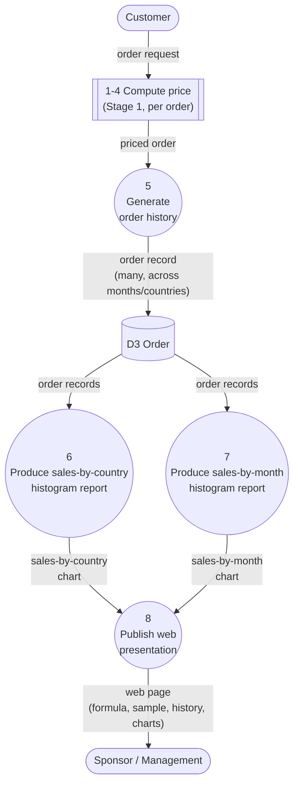

# Stage 2 — Sales History, Histograms & Sponsor Web Page
## Traditional (Structured) Analysis Design — extends Stage1_Design.md

Stage 2 reuses the Stage 1 pricing logic (processes 1–4) and adds new
processing to build up an order history, summarize it two ways, and present
it. This document only covers what's *new*; the pricing formula, discount
table, and VAT table are unchanged from Stage 1.

**Assumption:** the assignment says "different states." The only geographic
attribute in this domain is the 2-letter **country code** (DK/BE/DE/NL/FR),
so "state" is read here as "country." Everything below groups by
`country_code`.

---

## 1. New external agent

**Sponsor / Management** — receives the two histogram reports and the web
page presentation. Does not supply any input to the system (output-only
agent, like `Management` in the RMO example in the textbook).

---

## 2. Context diagram (updated)

```
                 Order request
   +----------+  (items, price, country, date)   +------------------------+
   |          | -------------------------------> |          0             |
   | Customer |                                   |  Order Price Calculator|
   |          | <------------------------------- |    & Reporting System  |
   +----------+   Priced order                    +------------------------+
                                                        |
                                                        | Sales histogram reports,
                                                        | Web page presentation
                                                        v
                                                  +-----------------+
                                                  | Sponsor /       |
                                                  | Management      |
                                                  +-----------------+
```

---

## 3. Data Flow Diagram — Level 1 additions (processes 5–8)

Processes 1–4 (Stage 1) are unchanged and are re-used inside process 5 for
every generated order. Data store **D3 Order** — written once per order in
Stage 1 — now accumulates many records and becomes the source for Stage 2's
reports.



Plain-text version:

```
 Customer -> [1-4 Compute price] -> priced order -> [5 Generate order history]
                                                              |
                                                              v
                                                       [ D3  Order ]  (many rows)
                                                        /            \
                                                       v              v
                                    [6 Sales-by-country report]  [7 Sales-by-month report]
                                                       \              /
                                                        v            v
                                                    [8 Publish web presentation]
                                                              |
                                                              v
                                                    Sponsor / Management
```

**Consistency check:** D3 Order is written by process 5 and read by 6 and 7
— no black holes, no miracles. Process 8 combines outputs of 6 and 7 plus a
sample from 1–4 and D3 itself; every output it produces traces back to an
input.

---

## 4. Process descriptions (structured English)

```
Process 5 - Generate order history
    For each (month, random sample) to simulate:
        Choose a country_code and a day within the month
        Choose number_of_items and unit_price
        Run Process 1-4 to get a priced_order
        Assign the next order_id
        Write order_record (order_id + priced_order + order_date) to D3 Order
    Endfor

Process 6 - Produce sales-by-country histogram report
    Read all order records from D3 Order
    Group order_total by country_code, summing within each group
    Draw a bar chart: one bar per country, height = summed order_total
    Send chart to Process 8

Process 7 - Produce sales-by-month histogram report
    Read all order records from D3 Order
    Group order_total by calendar month (YYYY-MM), summing within each group
    Draw a bar chart: one bar per month, height = summed order_total
    Send chart to Process 8

Process 8 - Publish web presentation
    Assemble one HTML page containing:
        - the pricing formula (from Stage 1 process descriptions)
        - one sample input and its priced-order output (Process 1-4)
        - a table of the sales history (D3 Order)
        - the sales-by-country chart (Process 6)
        - the sales-by-month chart (Process 7)
    Send web page to Sponsor / Management
```

---

## 5. ERD note

No new entities are required. The **ORDER** entity already carries
`country_code` and `order_date` (added in Stage 1 specifically so Stage 2
could group by them). D3 Order in the DFD *is* the ORDER entity — Stage 2
just accumulates many rows in it instead of one.

---

## 6. Implementation mapping

| DFD element                         | Code artifact                          |
|--------------------------------------|-----------------------------------------|
| Processes 1–4                        | `price_calculator.py`                   |
| D3 Order                             | `sales_history.csv` (the "spreadsheet") |
| Process 5 (Generate order history)   | `stage2_generate_orders.py`             |
| Process 6 (sales-by-country report)  | `stage2_reports.py` → `report_by_country.png` |
| Process 7 (sales-by-month report)    | `stage2_reports.py` → `report_by_month.png`   |
| Process 8 (web presentation)         | `stage2_build_webpage.py` → `index.html`      |
| Orchestration of 5→6/7→8             | `stage2_run_all.py`                     |
